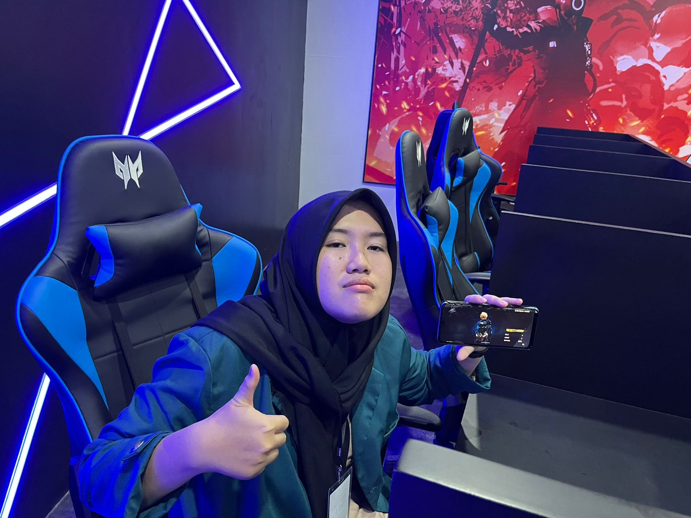

<h2 align="center"> Hello, I'm Kyla Nisrina Anggrahini! 👋 </h2> 

  

  

## 🚀 About Me
- 🏫 **University**: Universitas Lampung  
- 🏠 **Hometown**: Bandar Lampung  
- 🌱 **Currently Learning**: UI/UX Design, Mobile, Web Development  
- 💼 **Interests**: Full Stack Development, UI/UX Designer  

## 🛠️ Skills
### **Languages**

  
  
  
  
  
  
  

### **Frameworks & Tools**

  
  
  
  
  
  
  

## 💌 Let's Connect!
- 
- 
- 

## 🌟 Fun Facts
- 🎵 **Favorite Music**: India & Kpop  
- 🎮 **Favorite Games**: Free Fire & Cooking  
- 🧗‍♂️ **Hobbies**: Badminton and Silat

## 🐍 GitHub Snake Animation

