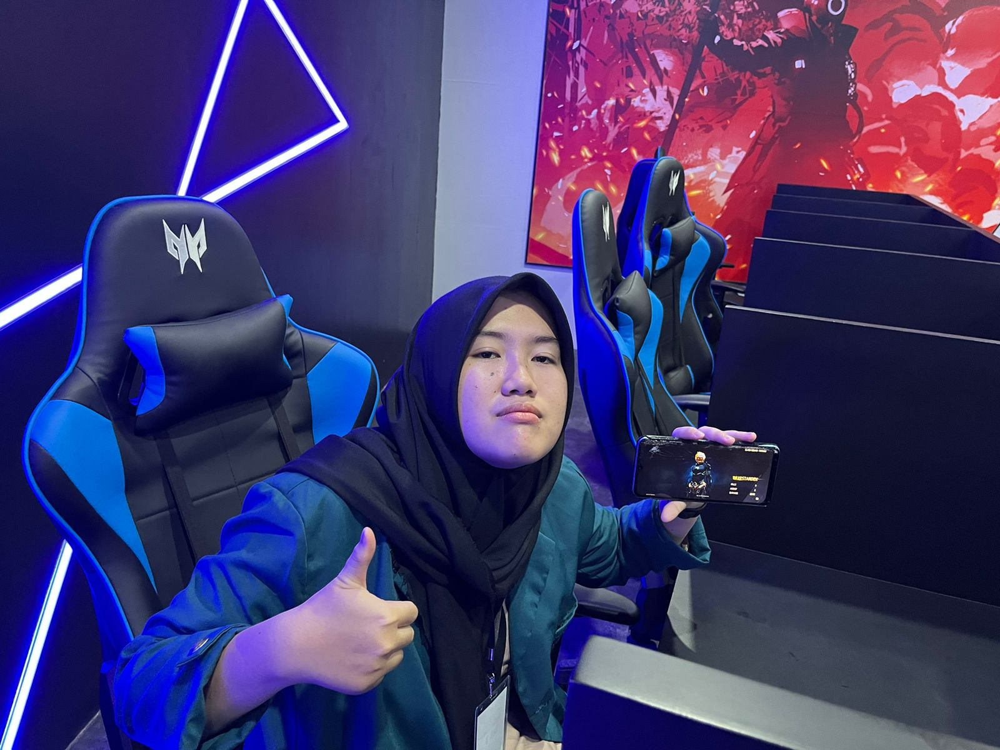

<h2 align="center"> Hello, I'm Kyla Nisrina Anggrahini! 👋 </h2> 

  

  

## 🚀 About Me
- 🏫 **University**: Universitas Lampung
- 🏠 **Hometown**: Bandar Lampung
- 🌱 **Currently Learning**: Desain UI/UX, Mobile, Web Design
- 🎯 **Hobbies**: Badminton and Silat
- 💼 **Interests**: Full Stack Development and UI/UX Desaigner

## 🛠️ Skills
- **Languages**: 
  

    
    
    
    
    
    
    
  

- **Frameworks**: 
  

    
    
  

- **Tools**: 
  

    
    
    
    
    
  

## 📫 Let's Connect!
- 
- 
- 

## 🌟 Fun Facts
- 🧗‍♂️ **Hobbies**: Badminton and Silat
- 🎵 **Favorite Music**: India and Kpop
- 🎮 **Favorite Games**: Free Fire and Cooking

---

